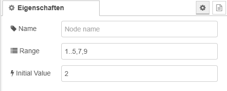
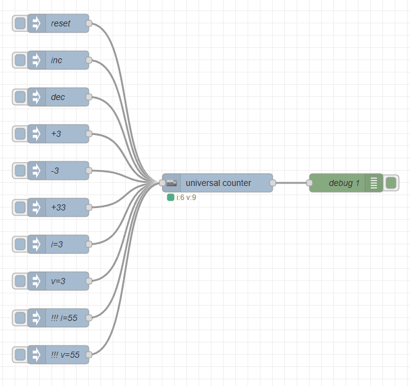

# Universal Counter Node for Node-RED

The **Universal Counter** Node for Node-RED is a configurable counter that allows you to increment, decrement, and set values based on a defined range. This node supports multiple control methods through different input topics and enables fine-grained control over the counter's behavior.

## Features

- **Configurable Range**: You can define a range of values or specific values for the counter.
- **Increment and Decrement**: The counter supports incrementing and decrementing by 1 or a custom value.
- **Set Initial Value**: Set the initial value for the counter.
- **Flexible Input**: Multiple input topics to control the counter state.
- **Reset Function**: Reset the counter to its starting state.
- **State Tracking**: Current value is tracked and output at each change.
- **Status Indicators**: Visual status to indicate the state of the counter.

## Installation

1. Install the node in your Node-RED environment:

   ```bash
   npm install @zebrajaeger/node-red-contrib-universal-counter
   ```

Then restart Node-RED.

## Configuration

### Node Properties



- **Name**: The name of the node.
- **Range***: A configurable range for the counter. You can specify ranges or individual values (e.g., 1..10, 5,7,9).
- **Initial Value**: The initial value of the counter, which must be within the specified range.

### Inputs

The **Universal Counter** node has one input, which expects a message with a topic and payload. The behavior is determined based on the topic:

- **r, rst, reset**: Resets the counter and outputs the value from the range corresponding to index 0.
- **val, setValue**: Sets the counter's value based on the provided payload. The value must exist within the defined range.
- **i, idx, setIndex**: Sets the counter's index based on the provided payload (a number). The index must be valid within the defined range.
- **++, inc, increment**: Increments the counter by 1 or a specified value.
- **--, dec, decrement**: Decrements the counter by 1 or a specified value.

### Outputs

The node has one output that returns the current counter value.

## Input Example

Send a message with the topic increment to increase the counter by 1:

```json
{
  "topic": "increment"
}
```

Send a message with the topic setValue and a payload of 8 to set the counter to 8:

```json
{
  "topic": "setValue",
  "payload": 8
}
```

## Output Example

Send a message with the topic increment to increase the counter by 1:
```json
{
  "payload": 8
}
```

## Example Flow

Below is an example flow for using the Universal Counter node in Node-RED:



```json
[
    {
        "id": "ada1fd42d961c385",
        "type": "tab",
        "label": "Flow 1",
        "disabled": false,
        "info": "",
        "env": []
    },
    {
        "id": "85d0673b4acf52e3",
        "type": "universal-counter",
        "z": "ada1fd42d961c385",
        "name": "",
        "range": "1..5,7,9",
        "initialValue": "2",
        "x": 750,
        "y": 420,
        "wires": [
            [
                "f08777574d2e58a9"
            ]
        ]
    },
    {
        "id": "f30256631cddd3bf",
        "type": "inject",
        "z": "ada1fd42d961c385",
        "name": "reset",
        "props": [
            {
                "p": "topic",
                "vt": "str"
            }
        ],
        "repeat": "",
        "crontab": "",
        "once": false,
        "onceDelay": 0.1,
        "topic": "reset",
        "x": 490,
        "y": 160,
        "wires": [
            [
                "85d0673b4acf52e3"
            ]
        ]
    },
    {
        "id": "3a4ac7e9829edefe",
        "type": "inject",
        "z": "ada1fd42d961c385",
        "name": "inc",
        "props": [
            {
                "p": "topic",
                "vt": "str"
            }
        ],
        "repeat": "",
        "crontab": "",
        "once": false,
        "onceDelay": 0.1,
        "topic": "++",
        "x": 490,
        "y": 220,
        "wires": [
            [
                "85d0673b4acf52e3"
            ]
        ]
    },
    {
        "id": "49439c55b89c7cde",
        "type": "inject",
        "z": "ada1fd42d961c385",
        "name": "dec",
        "props": [
            {
                "p": "topic",
                "vt": "str"
            }
        ],
        "repeat": "",
        "crontab": "",
        "once": false,
        "onceDelay": 0.1,
        "topic": "--",
        "x": 490,
        "y": 280,
        "wires": [
            [
                "85d0673b4acf52e3"
            ]
        ]
    },
    {
        "id": "6f0a2aa4fe576c5a",
        "type": "inject",
        "z": "ada1fd42d961c385",
        "name": "+3",
        "props": [
            {
                "p": "payload"
            },
            {
                "p": "topic",
                "vt": "str"
            }
        ],
        "repeat": "",
        "crontab": "",
        "once": false,
        "onceDelay": 0.1,
        "topic": "++",
        "payload": "3",
        "payloadType": "num",
        "x": 490,
        "y": 340,
        "wires": [
            [
                "85d0673b4acf52e3"
            ]
        ]
    },
    {
        "id": "09143e879192b8b9",
        "type": "inject",
        "z": "ada1fd42d961c385",
        "name": "-3",
        "props": [
            {
                "p": "payload"
            },
            {
                "p": "topic",
                "vt": "str"
            }
        ],
        "repeat": "",
        "crontab": "",
        "once": false,
        "onceDelay": 0.1,
        "topic": "--",
        "payload": "3",
        "payloadType": "num",
        "x": 490,
        "y": 400,
        "wires": [
            [
                "85d0673b4acf52e3"
            ]
        ]
    },
    {
        "id": "035811e7dd29efe8",
        "type": "inject",
        "z": "ada1fd42d961c385",
        "name": "+33",
        "props": [
            {
                "p": "payload"
            },
            {
                "p": "topic",
                "vt": "str"
            }
        ],
        "repeat": "",
        "crontab": "",
        "once": false,
        "onceDelay": 0.1,
        "topic": "++",
        "payload": "33",
        "payloadType": "num",
        "x": 490,
        "y": 460,
        "wires": [
            [
                "85d0673b4acf52e3"
            ]
        ]
    },
    {
        "id": "57fedcc5ec42baec",
        "type": "inject",
        "z": "ada1fd42d961c385",
        "name": "i=3",
        "props": [
            {
                "p": "payload"
            },
            {
                "p": "topic",
                "vt": "str"
            }
        ],
        "repeat": "",
        "crontab": "",
        "once": false,
        "onceDelay": 0.1,
        "topic": "setIndex",
        "payload": "3",
        "payloadType": "num",
        "x": 490,
        "y": 520,
        "wires": [
            [
                "85d0673b4acf52e3"
            ]
        ]
    },
    {
        "id": "b77e930df0e29c2b",
        "type": "inject",
        "z": "ada1fd42d961c385",
        "name": "v=3",
        "props": [
            {
                "p": "payload"
            },
            {
                "p": "topic",
                "vt": "str"
            }
        ],
        "repeat": "",
        "crontab": "",
        "once": false,
        "onceDelay": 0.1,
        "topic": "setValue",
        "payload": "3",
        "payloadType": "num",
        "x": 490,
        "y": 580,
        "wires": [
            [
                "85d0673b4acf52e3"
            ]
        ]
    },
    {
        "id": "38faadea2dc1866d",
        "type": "inject",
        "z": "ada1fd42d961c385",
        "name": "!!! i=55",
        "props": [
            {
                "p": "payload"
            },
            {
                "p": "topic",
                "vt": "str"
            }
        ],
        "repeat": "",
        "crontab": "",
        "once": false,
        "onceDelay": 0.1,
        "topic": "setIndex",
        "payload": "55",
        "payloadType": "num",
        "x": 490,
        "y": 640,
        "wires": [
            [
                "85d0673b4acf52e3"
            ]
        ]
    },
    {
        "id": "55cf54ddefa44d1c",
        "type": "inject",
        "z": "ada1fd42d961c385",
        "name": "!!! v=55",
        "props": [
            {
                "p": "payload"
            },
            {
                "p": "topic",
                "vt": "str"
            }
        ],
        "repeat": "",
        "crontab": "",
        "once": false,
        "onceDelay": 0.1,
        "topic": "setValue",
        "payload": "55",
        "payloadType": "num",
        "x": 490,
        "y": 700,
        "wires": [
            [
                "85d0673b4acf52e3"
            ]
        ]
    },
    {
        "id": "f08777574d2e58a9",
        "type": "debug",
        "z": "ada1fd42d961c385",
        "name": "debug 1",
        "active": true,
        "tosidebar": true,
        "console": false,
        "tostatus": false,
        "complete": "false",
        "statusVal": "",
        "statusType": "auto",
        "x": 960,
        "y": 420,
        "wires": []
    }
]
```
